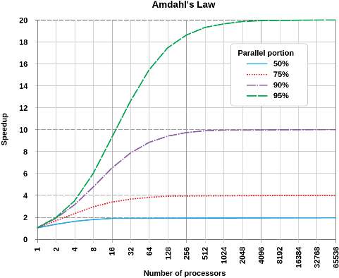
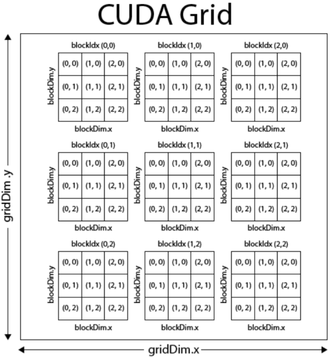

# Notes collected from the "*Hands-On GPU Programming with Python and CUDA*" book

## Abbreviations

* **BLAS** - Basic Linear Algebra Subprograms
* **CPU** - Central Processing Unit
* **CUDA** - Compute Unified Device Architecture
* **FFT** - Fast Fourier Transform
* **GIL** - Global Interpreter Lock (In Python)
* **GPGPU** - General Purpose Graphics Processing Unit
* **GPU** - Graphics Processing Unit
* **GeMM** - General Matrix Multiply
* **GeMV** - General Matrix-Vector Multiply
* **SIMD** - Single Instruction Multiple Data
* **SM** - Streaming Multiprocessor
* **SSE** - Streaming SIMD Extensions
* **SVD** - Singular Value Decomposition

## Terms and Definitions

* **Latency** - Beginning-to-end duration of a single computation.
* **Throughput** - Number of computations that can be performed simultaneously.
  * *CPU has low throughput and low latency, whereas GPU has high throughput and high latency.*
* **Parallelization** - Writing a program or algorithm in such a way that its execution workload can be split over multiple processors or threads simultaneously.
* **GPU query** - Basic operation that accesses specific technical details about the GPU, e.g., available memory or number of cores.
* **Compute capability** - It can be thought of as a *version number* for each NVIDIA GPU architecture.
* **Streaming Multiprocessor** (**SM**) - GPU divides its cores up into a larger unit known as SM. Every GPU device contains multiple SMs each of which provides a specific number of cores.
  * *The number of cores per SM is not indicated by the GPU itself but by its **compute capability***.
* **Device memory** or **global device memory** - The memory provided by the GPU irrespective of the host's memory.
* **Kernel** - A function that is launched directly on GPU by CUDA.
* **Device function** - A function that can only be called by a kernel or another device function.
* **Threads**, **blocks**, and **grids** - The data array is represented by a **grid** that is separated into multiple **blocks**, and each of these blocks (it is a block of blocks) is then split up into several **threads**.
* **Thread** - A sequence of operations that are executed on a single GPU core.
* **Race conditions** - A situation in which multiple threads concurrently read or write to the same memory address without proper synchronization.
* **Block level synchronization barrier** - Provided by the `__syncthreads()` function that causes every thread that is being executed within a particular block to stop its execution until all the threads have reached the `__syncthreads()` function.
  * *This synchronization does not work across blocks.*
* **Shared memory** - A specific type of memory that can be used for communication between threads within the same block.
  * *It is faster than relying on global memory access.*
* **Work efficiency** - A work efficient algorithm is a parallel algorithm that does not do more "work" than its serial counterpart.
* **Stream** - It is a sequence of operations that are run in order on the GPU.
  * *Streams are useful for achieving concurrency since multiple of them can be executed simultaneously.*
* **Event** - An object that exists on the GPU the purpose of which is to act as a milestone or progress marker for a stream of operations.
  * *It can be effectively exploited to time the execution of specific operations.*
* **Context** - A context is analogous to a process in an operating system. Each program thread is assigned a unique context within which its GPU execution takes place.
* **Branch divergence** - It happens when one thread in a kernel satisfies the conditions to be in an `if` statement, while another doesn't and is in the `else` statement.
* **Warp** - A group of threads, $32$ lanes.
* **Warp lockstep property** - Multiple threads in a single warp need to be in a *lockstep* as marines marching, therefore only the very same piece of code can be executed even if branch divergence is present.
* **Pseudo-random sequences caveat** - The numbers are mutually *random* only if generated by the **same seed**.
* **Intrinsic CUDA functions** - Mathematical functions with less precision but faster computation, e.g., `__sinf(x)`.

## Amdahl's Law

This concept can be used to estimate **potential speedup** as a result of **parallelization**. It only requires the knowledge of the **parallelizable portion** of the **execution time** for code in the original serial program. In the equation, the parallelization part is denoted as $p$. Considering this, the non-parallelizable part (serial) of the program is $1 - p$. Let $N$ be the number of workers. Then, the speedup $S$ can be computed as 

$$S = \frac{1}{\left( 1 - p \right) + \frac{p}{N}}.$$

|  |
| :---: |
| *The theoretical speedup of the latency of the execution of a program as a function of the number of processors executing it, according to Amdahl's law. The speedup is limited by the serial part of the program. For example, if 95% of the program can be parallelized, the theoretical maximum speedup using parallel computing would be 20 times. ([source](https://en.wikipedia.org/wiki/Amdahl%27s_law))* |

## Indexing

### 1D Indexing

The thread's index is computed by the following formula:
```
i = (blockDim.x * blockIdx.x) + threadIdx.x
```

### 2D Indexing

In the context of a 2D grid, the thread and block indices are computed as:
```
blockId = (gridDim.x * blockIdx.y) + blockIdx.x
threadId = blockId * (blockDim.x * blockDim.y) + (blockDim.x * threadIdx.x) + threadIdx.x
```

|  |
| :---: |
| *Visualization of the CUDA indexing scheme. ([source](http://harmanani.github.io/classes/csc447/Notes/Lecture15.pdf)* |

## BLAS

* It stands for **Basic Linear Algebra Subprograms**.
* It is a **specification** for basic linear algebra library **standardized** in the 1970s.
* BLAS functions are broken down into several **categories**, which are referred to as **levels**.
  * Level 1 - **AXPY** - **vector-vector addition and scaling**, i.e., $a\mathbf{x} + \mathbf{y}$ operations, such that $a \in \mathbb{R}$ and $\mathbf{x}, \mathbf{y} \in \mathbb{R}^n$, **dot products**, and **norms**.
  * Level 2 - **GEMV** - **matrix multiplication of a vector**.
  * Level 3 - **GEMM** - **general matrix-matrix** operations.

## CUDA Thrust library

* The library's central feature is high-level vector container that is similar to C++'s own vector container.

```C++
#include <thrust/host_vector.h>
#include <thrust/device_vector.h>

int main()
{
    thrust::host_vector<int> vec_h;
    
    vec_h.push_back(0);
    vec_h.push_back(1);
    vec_h.push_back(2);

    thrust::device_vector<int> vec_d = vec_h;  // Simple transfer to GPU!

    vec_d.push_back(3);

    return 0;  
}
```

## Useful commands

* Run **Python profiler** and output **cumulative running time** for individual functions and methods.
```bash
python -m cProfile -s cumtime module.py
```

* **Detailed information** about the used **CPU**.
```bash
lscpu
```

* **Information** about the **GPU**.
```bash
lspci
```

* **Information** about current **memory usage**.
```bash
free
```

* **Information** about the **CUDA compiler** version.
```bash
nvcc --version
```

* **Compile** a **CUDA C** program.
```bash
nvcc source.cu -o program
```